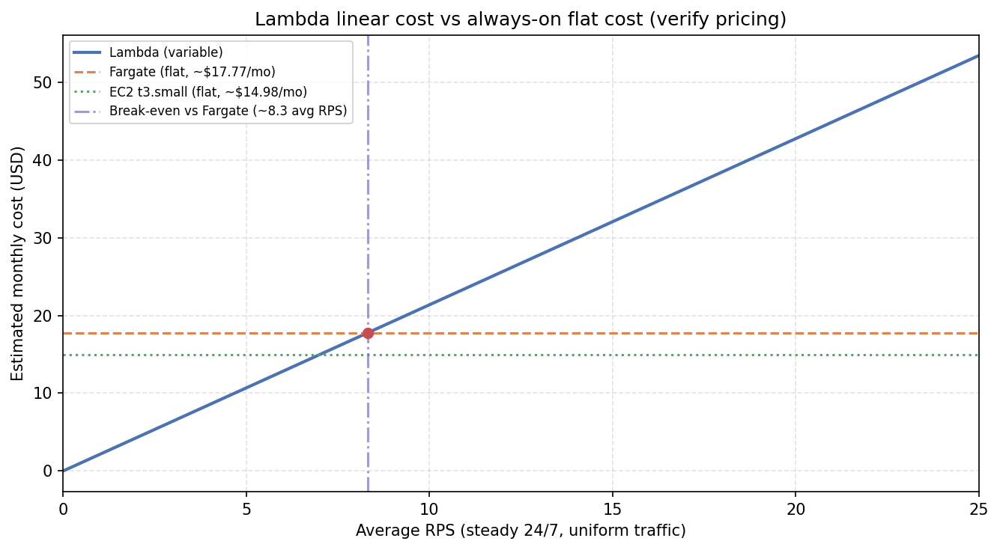

# AWS Cloud Lab Report

Measurements were taken in **us-east-1** (AWS Academy). Load-test output is under `results/`; charts under `results/figures/`.

---

## Assignment 1: Deploy all environments

Four targets run the same k-NN workload (Lambda zip, Lambda container, Fargate + ALB, EC2 `t3.small`). Endpoint checks are saved in `assignment-1-endpoints.txt`.

For the fixed query in `loadtest/query.json`, all four endpoints returned the same top-5 neighbors:

| Rank | Index | Distance |
|------|-------|----------|
| 1 | 35859 | 12.001459121704102 |
| 2 | 24682 | 12.059946060180664 |
| 3 | 35397 | 12.487079620361328 |
| 4 | 20160 | 12.489519119262695 |
| 5 | 30454 | 12.499402046203613 |

---

## Assignment 2: Scenario A — cold start

**Method:** After at least 20 minutes without Lambda traffic, `oha` sent 30 sequential POSTs (1/s) per variant with SigV4 authentication (`scenario-a.sh`). CloudWatch `REPORT` lines were exported to `cloudwatch-zip-reports.txt` and `cloudwatch-container-reports.txt`. All requests returned HTTP **200**.

**Client (`oha`):** zip slowest **1655 ms**, p50 **229 ms**; container slowest **1674 ms**, p50 **224 ms** (`scenario-a-zip.txt`, `scenario-a-container.txt`).

**Server (first cold REPORT):**

| Variant | Init duration | Handler duration |
|---------|---------------|------------------|
| Zip | 615.32 ms | 77.11 ms |
| Container | 685.43 ms | 82.00 ms |

Warm invocations omit `Init Duration`; handler durations in the exports are mostly ~65–115 ms.

**Which requests were cold:** In both exports, only **request 1** has a `REPORT` line with **`Init Duration`** (cold). **Requests 2–30** are warm (no `Init Duration` on the line). That matches sequential 1 req/s traffic: the first hit pays init; the rest reuse warm environments.

| Request # | Zip | Container |
|-----------|-----|-----------|
| 1 | Cold | Cold |
| 2–30 | Warm | Warm |

**Decomposition:** estimated **network / platform overhead** on a cold path ≈ client total − Init − handler `Duration`; on warm paths, residual overhead ≈ client p50 − handler `Duration` (~75 ms from `REPORT`). This is not pure RTT—it includes TLS and Function URL front door, same as the guide’s residual method.

**Zip vs container:** init is **lower for zip (615 ms) than container (685 ms)**, consistent with zip + layer vs container image startup.

**Figure:** `figures/latency-decomposition.png` (stacked bars: network vs init vs handler).

---

## Assignment 3: Scenario B — warm steady-state

**Method:** `scenario-b.sh` runs a warm-up phase, then 500 requests per configuration. Outputs: `scenario-b-*.txt`. All runs returned HTTP **200**.

**Client-side percentiles (ms)** from `oha`:

| Environment | Concurrency | p50 | p95 | p99 | Server avg (ms) |
|-------------|-------------|-----|-----|-----|-----------------|
| Lambda (zip) | 5 | 222.0 | 271.7 | 536.7 | 75.3 |
| Lambda (zip) | 10 | 221.4 | 253.8 | 546.6 | 75.3 |
| Lambda (container) | 5 | 220.9 | 329.4 | 605.0 | 77.2 |
| Lambda (container) | 10 | 218.3 | 283.2 | 601.3 | 77.2 |
| Fargate | 10 | 802.4 | 1063.2 | 1214.8 | 23.9 |
| Fargate | 50 | 3990.1 | 4295.9 | 4393.0 | 23.9 |
| EC2 | 10 | 324.3 | 455.8 | 1312.1 | 24.1 |
| EC2 | 50 | 927.0 | 1130.5 | 1899.5 | 24.1 |

**Server avg:** **Lambda** — mean CloudWatch **`Duration`** on warm invocations (no `Init Duration`), from `cloudwatch-zip-reports.txt` / `cloudwatch-container-reports.txt` (**75.3 ms** zip, **77.2 ms** container); same handler cost at both concurrencies. **Fargate / EC2** — the guide asks for `query_time_ms` from the app during Scenario B; I did not save separate `curl` captures during those runs. The values in the table (**23.9** / **24.1** ms) come from **`query_time_ms`** in `assignment-1-endpoints.txt` (same container image and query). That is defensible here: the handler is CPU-bound and stays ~20–25 ms while **p50/p99 blow up from queueing** on one task/instance—so server work did not become the bottleneck. Client p50 (~**220 ms** for Lambda) is still much higher than server avg because of **TLS**, **Function URL**, and **RTT**.

**Tail behaviour:** several rows have **p99 ≫ 2× p95** (e.g. Lambda zip at c5, Fargate at c50), indicating long tails and queueing.

**Lambda c5 vs c10:** p50 changes little because concurrent requests use **separate execution environments** (within the account limit).

**Fargate/EC2 c10 vs c50:** p50 rises sharply — **one task / one instance**; higher concurrency queues behind the same CPU.

**Client p50 vs `query_time_ms`:** the client timer includes **RTT + TLS + ALB** (Fargate) and **Function URL** overhead (Lambda).

---

## Assignment 4: Scenario C — burst from zero

**Method:** After idle long enough for Lambda to release execution environments, `scenario-c.sh` issued **200 requests** to all four targets concurrently: Lambda zip and container at **concurrency 10**; Fargate and EC2 at **concurrency 50**. Outputs: `scenario-c-lambda-zip.txt`, `scenario-c-lambda-container.txt`, `scenario-c-fargate.txt`, `scenario-c-ec2.txt`. All runs: HTTP **200** (200 responses each).

**Client percentiles (ms)** — values taken from `oha` (seconds converted to ms where needed):

| Target | p50 (ms) | p95 (ms) | p99 (ms) | Max (ms) |
|--------|----------|----------|----------|----------|
| Lambda (zip) | 224.4 | 1515.4 | 1574.7 | 1581.8 |
| Lambda (container) | 223.9 | 1293.3 | 1377.0 | 1397.1 |
| Fargate | 4000.7 | 4297.2 | 4506.3 | 4681.1 |
| EC2 | 864.3 | 1471.5 | 1860.7 | 1877.2 |

**Bimodal Lambda:** histograms show a dense band near **~220 ms** (warm) and a tail near **~1.3–1.6 s** (cold starts and/or new environments under burst). Both zip and container show this.

**Comparison:** Under this burst, Fargate’s median latencies are dominated by **queueing** on a single task at c=50 (p50 ≈ **4 s**). Lambda’s tail mixes **init and routing**; the warm band stays near **~220 ms**, but cold paths pull **p99** up.

**SLO (p99 \< 500 ms):** **not met** here — Lambda p99 ≈ **1.4–1.6 s**, EC2 ≈ **1.9 s**, Fargate ≈ **4.5 s**. Mitigations: **Lambda** — provisioned concurrency / concurrency limits; **Fargate/EC2** — more tasks or instances, auto-scaling.

**Cold-start count (Lambda):** The guide’s ground truth is CloudWatch **`Init Duration`** lines in the burst window. I could not archive a dedicated burst-window log export before the Academy session ended. As a **proxy**, I counted client responses in the **≥ 1.0 s** bins in `scenario-c-lambda-zip.txt` / `scenario-c-lambda-container.txt` (**11** / 200 zip, **10** / 200 container)—that band is **consistent with** init + handler + TLS overhead, **rather than** the ~220 ms warm cluster. **~10** slow paths **match** the **10** concurrent execution environments allowed in the Learner Lab, i.e. expected scaling after full idle reclamation. A full CloudWatch pull would label each init explicitly; this estimate is consistent with that behavior.

---

## Assignment 5: Cost at zero load

**Pricing source:** screenshots of the official AWS pricing pages for **US East (N. Virginia) (`us-east-1`)**, dated **March 2026**, stored under `figures/pricing-screenshots/`.

### List prices used

| Service | Component | Price | Unit |
|---------|-----------|-------|------|
| **Lambda** | Requests | **$0.20** | per 1M requests |
| **Lambda** | Duration (x86) | **$0.0000166667** | per GB-second |
| **Fargate** | vCPU (Linux/x86) | **$0.04048** | per vCPU-hour |
| **Fargate** | Memory (Linux/x86) | **$0.004445** | per GB-hour |
| **EC2** | `t3.small` (Linux, on-demand) | **$0.0208** | per hour |

### Idle load (0 RPS) — monthly estimate

Assume resources run **24×7** for a **30-day month** (**720 hours**), which matches “always on” Fargate/EC2 in this lab even when traffic is zero.

| Environment | Monthly cost (idle / 0 RPS) | Notes |
|-------------|-----------------------------|--------|
| **Lambda** | **$0.00** | No charge when there are **no invocations**; no idle capacity fee. |
| **Fargate** (1 task: **0.5 vCPU**, **1 GiB**) | **~$17.77** | \((0.5 \times 0.04048 + 1 \times 0.004445) \times 720 \approx 17.77\) USD/month. |
| **EC2** (`t3.small`) | **~$14.98** | \(0.0208 \times 720 \approx 14.98\) USD/month. |

**Which has zero idle cost?** **Lambda** — you only pay when the function runs. **Fargate** and **EC2** bill for **provisioned** CPU/memory or the **instance hour** even if RPS = 0, as long as the task or instance stays up.

### 18 h/day “idle” vs 6 h/day “active” (guide wording)

If you interpret “idle” as **hours per day the service is unused** while the **task/instance stays up**, the **idle-time share** of the monthly always-on bill scales by **18/24**:

| Environment | Full month (24×7) | Idle-time share only (18 h/day) |
|-------------|-------------------|-----------------------------------|
| **Fargate** | ~$17.77 | ~$17.77 × (18/24) ≈ **$13.33** |
| **EC2** (`t3.small`) | ~$14.98 | ~$14.98 × (18/24) ≈ **$11.24** |

- **Lambda:** hours with **no requests** still cost **$0**; you are not billed for “idle hours” separately.
- **Fargate / EC2:** this lab keeps **one** task and **one** instance running **24×7**, so you pay the **full** monthly rates above even when RPS = 0. The 6 h/day with traffic does not remove the off-peak hour cost unless you **stop or scale to zero**.

---

## Assignment 6: Cost model, break-even, recommendation

### Traffic model (lab brief)

| Phase | Rate | Window / day | Requests/day |
|-------|------|----------------|--------------|
| Peak | 100 RPS | 30 min = 1 800 s | \(100 \times 1\,800 = 180\,000\) |
| Normal | 5 RPS | 5.5 h = 19 800 s | \(5 \times 19\,800 = 99\,000\) |
| Idle | 0 RPS | 18 h | 0 |

**Requests per day:** \(180\,000 + 99\,000 = 279\,000\).

**Requests per month (30 days):** \(N = 279\,000 \times 30 = 8.37 \times 10^{6}\).

### Lambda monthly cost (lab formula)

Memory **512 MB** → **0.5 GB**. Handler duration **\(d = 0.075\) s** (**75 ms**) from warm **CloudWatch `Duration`** on `REPORT` lines (aligned with Scenario B server-side time, not client `oha`).

\[
\text{GB-seconds/month} = N \cdot d \cdot 0.5 = 8.37 \times 10^{6} \times 0.075 \times 0.5 = 313\,875
\]

\[
\text{Cost}_{\text{req}} = N \cdot \frac{0.20}{10^{6}} \approx \$1.67,\quad
\text{Cost}_{\text{dur}} = 313\,875 \times 0.0000166667 \approx \$5.23
\]

\[
\text{Cost}_{\lambda} \approx \$1.67 + \$5.23 = \textbf{\$6.90/month}
\]

Zip and container Lambdas share the same memory and workload; **variable cost is the same** under this model.

### Always-on monthly cost (single task / single instance)

Same **March 2026** `us-east-1` rates as Assignment 5:

| Environment | Formula | Monthly (USD) |
|-------------|---------|----------------|
| **Fargate** (0.5 vCPU, 1 GiB) | \((0.5 \cdot 0.04048 + 1 \cdot 0.004445) \times 720\) | **~17.77** |
| **EC2** (`t3.small`) | \(0.0208 \times 720\) | **~14.98** |

### Summary: cost under the traffic model

The traffic model averages **279 000 requests/day** over **86 400 s** ≈ **3.23 RPS**—**below** the break-even points (~**8.3** RPS vs Fargate, ~**7.0** RPS vs EC2), so **Lambda stays cheaper** than one always-on task/instance under this simplified uniform-cost model.

| Environment | Estimated monthly cost | Notes |
|-------------|------------------------|--------|
| **Lambda** | **~$6.90** | Per request + GB-s only. |
| **Fargate** | **~$17.77** | One task 24×7. |
| **EC2** | **~$14.98** | One instance 24×7. |

### Break-even RPS — Lambda vs Fargate (algebra)

Define **\(k\)** = Lambda cost **per request** (request charge + duration in GB-s):

\[
k = \frac{0.20}{10^{6}} + d \cdot M_{\text{GB}} \cdot 0.0000166667
  = 2\times 10^{-7} + 0.075 \times 0.5 \times 1.66667\times 10^{-5}
  = 8.25\times 10^{-7}\ \text{USD/request}
\]

Steady average **\(R\)** requests/s for a 30-day month: \(N = R \cdot 30 \cdot 24 \cdot 3600 = R \cdot 2\,592\,000\).

Lambda monthly: **\(C_\lambda(R) = k \cdot R \cdot 2\,592\,000\)**.

Set **\(C_\lambda(R) = C_F\)** with Fargate flat **\(C_F \approx \$17.77\)**:

\[
R = \frac{C_F}{k \cdot 2\,592\,000}
  = \frac{17.77}{8.25\times 10^{-7} \cdot 2\,592\,000}
  \approx \textbf{8.3 RPS}
\]

Below **~8.3 RPS** (this simplified uniform model), Lambda is **cheaper** than one always-on Fargate task; above it, **\(C_\lambda\)** exceeds **\$17.77**.

**Break-even vs EC2** (\(C_{\text{EC2}} \approx \$14.98\)):

\[
R = \frac{14.98}{8.25\times 10^{-7} \cdot 2\,592\,000} \approx \textbf{7.0 RPS}
\]

### Cost vs RPS figure

Figure file: `figures/cost-vs-rps.png` — Lambda cost vs **\(R\)** with horizontal lines for Fargate (~\$17.77) and EC2 (~\$14.98).

### Recommendation

**Environment:** For this traffic mix and the measured latencies, **Lambda** is cheapest (**~\$6.90**/month vs **~\$15–18** for always-on Fargate/EC2).

**SLO (p99 \< 500 ms):** **Not met as deployed.** Scenario **B**: Lambda zip **p99 ~537–547 ms** (c5/c10). Scenario **C**: Lambda **p99 ~1.4–1.6 s**; Fargate/EC2 worse. So the takeaway is **Lambda on cost**, with **latency work** (provisioned concurrency, scaling)—not “Lambda wins on SLO” out of the box.

**Changes:** **Provisioned concurrency** (and/or memory tuning) on Lambda to shrink cold tail; **more Fargate tasks / EC2 capacity or auto-scaling** to cut queueing. Single-task Fargate and single-instance EC2 are **not** SLO-safe at higher concurrency.

**Numbers used:** **\$6.90** vs **\$17.77 / \$14.98**; break-even **~8.3 RPS** vs Fargate (~**7.0 RPS** vs EC2); **p99** from the Scenario B/C tables.

**When I’d switch:** Sustained average load **past** break-even (always-on can win); a **relaxed** p99; or a **different** layout (more tasks/AZs, autoscaling).