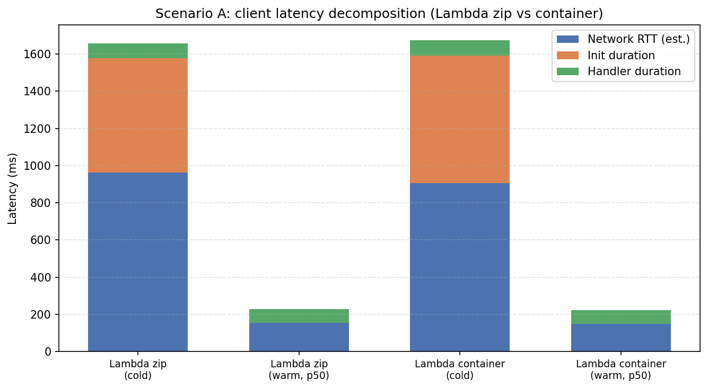

# AWS Cloud Lab Report

This report covers Assignments 1–2 with measured data from this repository. Complete Assignments 3–6 (Scenarios B–C, cost, recommendation) and extend this document before final submission.

---

## Assignment 1: Deploy all environments

### What was deployed

Four targets in `us-east-1`, all running the same k-NN workload (shared Docker image / same code paths):

| Target | Technology |
|--------|------------|
| A | Lambda (zip deployment + NumPy layer), Function URL (IAM auth) |
| B | Lambda (container image from ECR), Function URL (IAM auth) |
| C | ECS Fargate behind an Application Load Balancer |
| D | EC2 `t3.small` running the container on port 8080 |

### Correctness check

Raw terminal output with successful responses is saved in `assignment-1-endpoints.txt`.

For the same fixed query vector (`loadtest/query.json`), all four endpoints returned **identical top-5 neighbour results** (same `index` and `distance` values):

| Rank | Index | Distance |
|------|-------|----------|
| 1 | 35859 | 12.001459121704102 |
| 2 | 24682 | 12.059946060180664 |
| 3 | 35397 | 12.487079620361328 |
| 4 | 20160 | 12.489519119262695 |
| 5 | 30454 | 12.499402046203613 |

Lambda responses were checked via `aws lambda invoke` (Function URLs require IAM signing for plain HTTP). Fargate and EC2 were checked with `curl` POST to `/search`.

**Conclusion:** Deployment satisfies Assignment 1: same workload and matching `results` across Lambda zip, Lambda container, Fargate, and EC2.

---

## Assignment 2: Scenario A — cold start characterization

### Method

- After at least 20 minutes without Lambda traffic, `oha` sent **30 sequential requests** (1/s) to each Function URL, with AWS SigV4 signing (`loadtest/scenario-a.sh`).
- Outputs: `scenario-a-zip.txt`, `scenario-a-container.txt` (all requests returned HTTP **200**).
- CloudWatch Lambda REPORT lines exported to `cloudwatch-zip-reports.txt` and `cloudwatch-container-reports.txt`.

### Client-side latency (from `oha`)

**Lambda zip**

- Slowest request: **1655.3 ms** (consistent with a cold start plus network).
- p50: **229.0 ms** (mostly warm execution environments after the first cold).

**Lambda container**

- Slowest: **1673.8 ms**.
- p50: **223.9 ms**.

### Server-side timing (CloudWatch REPORT)

First invocation in each burst includes **`Init Duration`** (cold start):

| Variant | Init duration | Handler `Duration` (that request) |
|---------|---------------|-----------------------------------|
| Zip | 615.32 ms | 77.11 ms |
| Container | 685.43 ms | 82.00 ms |

Subsequent REPORT lines omit `Init Duration`; handler durations cluster around **~65–88 ms** (warm).

### Estimated network RTT

Using the guide’s decomposition:

- **Cold:** \(\text{RTT} \approx t_{\text{client}} - \text{Init Duration} - \text{Duration}\).
- **Warm (p50):** \(\text{RTT} \approx t_{\text{p50}} - \text{Duration}\) (no init).

This leaves substantial estimated RTT on cold paths (TLS + round trip + Function URL overhead), while warm p50 is dominated by handler time plus a smaller network component.

### Zip vs container cold start

From these samples, **zip init (615 ms) is lower than container init (685 ms)**. Container images typically pay extra image/runtime initialization versus a zip + layer load, though exact ordering can vary by configuration and load pattern.

### Figure

Stacked bar chart (network vs init vs handler) for cold vs warm (p50) for both variants:

Source data and plotting script: `figures/gen_latency_decomposition.py`.

---

## Next steps (Assignments 3–6)

1. Run **Scenario B** and **Scenario C**; save all `scenario-b-*.txt` and `scenario-c-*.txt`.
2. Add **pricing screenshots** under `figures/pricing-screenshots/`.
3. Complete **cost model**, **break-even**, **`cost-vs-rps`** figure, and **recommendation** (Assignments 5–6).
4. Run **`deploy/99-cleanup.sh`** when finished.
